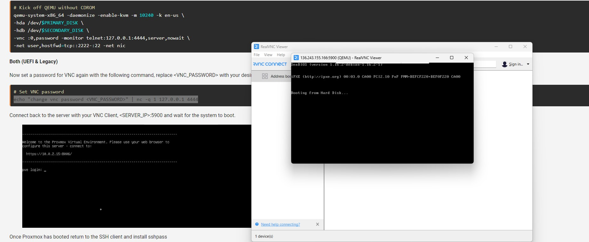
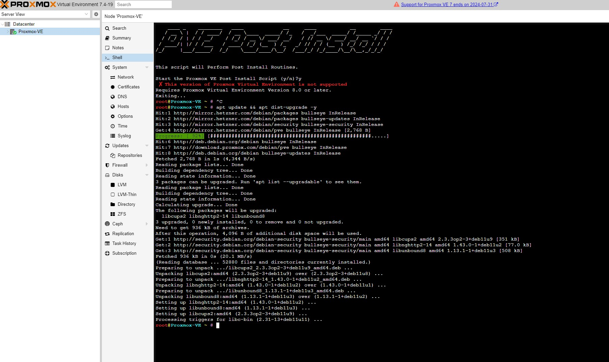
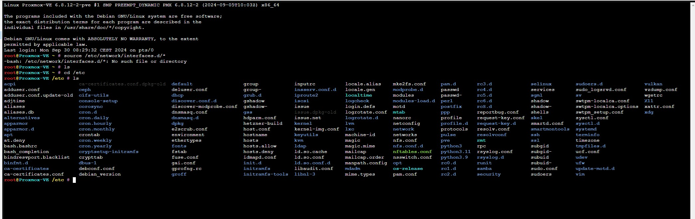

# Cloud Server Setup Guide

## 1. Infrastructure Summary

[View Infrastructure Diagram](01_Infrastructure_hardware/infrastructure_diagram.html)

### 1.1 Operating Systems

- Linux: Highly customizable and versatile, suitable for a wide range of applications and hardware.
- Windows Server: Offers a familiar interface and strong integration with Microsoft products, making it a popular choice for businesses.
- macOS: Apple's proprietary operating system for its computers, known for its user-friendly interface and integration with Apple devices.
- Android: A mobile operating system based on Linux, used by most smartphones and tablets.
- iOS: Apple's mobile operating system, used by iPhones and iPads.
Chrome OS: A lightweight operating system developed by Google, primarily designed for web-based applications.
- FreeBSD: A Unix-like operating system known for its stability and performance.
- OpenBSD: A BSD-based operating system with a strong focus on security.
- Solaris: A proprietary operating system developed by Oracle, primarily used for servers and high-performance computing.
- AIX: A proprietary operating system developed by IBM for its Power Systems hardware.
- HP-UX: A proprietary operating system developed by HP for its Itanium-based servers.

<<<<<<< HEAD
## 1.2. Virtualization Platform

#### Proxmox VE is a free, open-source virtualization platform for Linux. It uses KVM, a powerful hypervisor, and offers a web-based management interface. You can create VMs and containers, manage storage, and ensure high availability.

- KVM-based virtualization: Leveraging the efficient and high-performance KVM hypervisor, Proxmox VE allows you to create and run virtual machines (VMs) directly on your physical hardware.
- Web-based management: The user-friendly web interface provides a centralized dashboard for managing all your virtualized environments, including VMs, containers, and storage.
- Container support: In addition to VMs, Proxmox VE supports LXC (Linux Containers) for running lightweight, isolated applications within a single operating system kernel.
- Storage management: The platform offers tools for managing various storage types, including local disks, iSCSI, NFS, and Ceph, ensuring efficient data storage and retrieval.
- High availability: Proxmox VE includes features like clustering and HA (High Availability) to ensure continuous operation and minimize downtime.
- API integration: The platform provides a RESTful API, allowing for automation and integration with other systems.

#### 1.2.1 Software and Services
=======
### Virtual Machines

The choice of virtualization technology depends on your specific needs and environment. Here are some considerations for each option:

Proxmox VE:

Pros:
Open-source and free.
Supports both KVM and LXC containers.
Web-based management interface.
Good for enterprise environments.
Cons:
Requires a dedicated server.
Might be overkill for small-scale or personal projects.
VirtualBox:

Pros:
Free and open-source.
Easy to set up and use.
Good for desktop virtualization.
Cons:
Not as performant as bare-metal hypervisors.
Limited scalability for enterprise use.
VMware ESXi:

Pros:
High performance and reliability.
Widely used in enterprise environments.
Extensive support and documentation.
Cons:
Requires a license for advanced features.
Can be complex to set up and manage.
KVM (Kernel-based Virtual Machine):

Pros:
Integrated into the Linux kernel.
High performance and scalability.
Suitable for both personal and enterprise use.
Cons:
Requires more manual setup and management.
No native GUI management interface (though tools like Virt-Manager can be used).
Recommendations:
For Personal Use or Small Projects: VirtualBox is a good choice due to its ease of use and setup.
For Enterprise or Large-Scale Deployments: Proxmox VE or VMware ESXi are better suited due to their advanced features and scalability.
For Linux Enthusiasts or Custom Solutions: KVM offers flexibility and performance but requires more hands-on management.

### 1.2 Software and Services
>>>>>>> 33d1083 (server)

- Web Servers: Nginx, Apache
- Databases: MySQL, PostgreSQL, MongoDB
- Containers: Docker, Kubernetes

### 1.3 Data Science and Engineering Tools

- Data Science: Jupyter Notebook, RStudio, Anaconda
- Data Engineering: Apache Hadoop, Apache Spark, Kafka

### 1.4 AI/ML Frameworks

- TensorFlow, PyTorch, Hugging Face (LLaMA)
- Continuous Learning Pipeline
- Document Generation: Automated proposal and roadmap creation tools

### 1.5 Monitoring and Management Tools

- Monitoring: Prometheus, Grafana, Zabbix
- Configuration Management: Ansible, Terraform
- Backup: Rsync, Bacula, Veeam

### 1.6 Data Governance

- Data Governance Framework
- Data Cataloging: Apache Atlas, Collibra
- Data Quality Management: Talend, Informatica, Great Expectations
- Data Security and Compliance: Encryption, Apache Ranger, AWS IAM
- Data Lineage: Apache Atlas, Alation
- Master Data Management (MDM): Informatica MDM, TIBCO
- Data Governance Platform: Collibra, Informatica
- Monitoring and Reporting: Grafana, Tableau

### 1.7 Media Server

- Jellyfin: A great choice for a personal media server. It's open-source, supports various formats, and offers a user-friendly interface
- FFmpeg, HandBrake: These tools can be used to transcode media files to compatible formats for streaming. While optional, they can be helpful for ensuring smooth playback on different devices.
- Wi-Fi configuration for projector connectivity

### 1.8 Backup System for Phone Photos and Videos

- Nextcloud: A versatile solution for both file storage and syncing. It's easy to set up and offers a mobile app for convenient backups.
- ZFS/Btrfs: These are powerful file systems known for their reliability and features like snapshotting and data integrity. They're excellent choices for long-term storage.
- NAS: A Network Attached Storage device can provide additional storage capacity and can be integrated with Nextcloud for increased redundancy.

### 1.9 AI-Powered Messaging and Calendar Management

- LLaMA AI Model: For natural language processing
- Custom Chatbot: Integrated with the LLaMA model
- Google Calendar API/Nextcloud Calendar: For calendar management
- Nextcloud Tasks: For task management
- GPU (optional): For AI processing acceleration

### 1.10 AI for Business and Technical Management

- Data Lakes and Warehousing: For storing and analyzing client data
- Document Generation: Automated proposals and roadmaps
- CRM Integration: Track client interactions and projects
- Project Management Integration: AI-powered task and project tracking
- AI Dashboard: Centralized control and monitoring interface
- Enhanced Compute Power: Additional CPUs, RAM, and GPUs

## 2. Server Setup

### 2.1 Why Create Server from Rescue

- Cost-effective and flexible
- Activated, currently booted in the Rescue System

### 2.2 Getting Started

- **Outgoing Traffic:** Ports 25 and 465 are blocked by default; unblocking available upon request
- **Downloads:** Tools, packages, and OS images available at [Hetzner Downloads](https://download.hetzner.com)
- **Quick Start Guide:** Available at [Hetzner Docs](https://docs.hetzner.com)
- **How to install NextCloud on Proxmox with Ubuntu?** https://edywerder.ch how-to-install-nextcloud-on-proxmox-with-ubuntu/
- **Proxmox Containers vs VM: Which is Right for Your Needs?** https://edywerder.ch/proxmox-containers-vs-vm/
https://www.youtube.com/watch?v=cf3OljqAxEU
https://github.com/ariadata/proxmox-hetzner?tab=readme-ov-file
### SSH isuees 
Certainly. I'll guide you through a series of command-line steps to verify and troubleshoot your SSH connection issues. Run these commands on the server you're trying to connect to (136.243.155.166). You'll need root access or the ability to use sudo.

Check SSH service status:
Copysudo systemctl status sshd

Verify SSH server is listening on port 22:
Copysudo ss -tuln | grep :22

Check SSH configuration file for errors:
Copysudo sshd -T

Increase SSH daemon logging:
Copysudo sed -i 's/#LogLevel INFO/LogLevel DEBUG3/' /etc/ssh/sshd_config
sudo systemctl restart sshd

Check authorized keys file for root:
Copyls -la /root/.ssh/authorized_keys
cat /root/.ssh/authorized_keys

Verify permissions on SSH directories and files:
Copyls -la /root/.ssh
sudo chmod 700 /root/.ssh
sudo chmod 600 /root/.ssh/authorized_keys

Check SSH logs for error messages:
Copysudo tail -f /var/log/auth.log
(On some systems, it might be /var/log/secure)
Check for any IP blocking rules:
Copysudo iptables -L

Verify PAM configuration:
Copycat /etc/pam.d/sshd

Check for SELinux interference (if applicable):
Copygetenforce
If it returns "Enforcing", try:
Copysudo setenforce 0
Then try connecting again. If it works, SELinux might be the issue.
Test SSH connection locally:
Copyssh -vv root@localhost


After running these commands, try to connect again from your client machine:
Copyssh -vvv root@136.243.155.166
Watch the server's auth log while attempting to connect:
Copysudo tail -f /var/log/auth.log
These steps should help identify where the issue lies. After troubleshooting, remember to revert any temporary changes:
Copysudo sed -i 's/LogLevel DEBUG3/#LogLevel INFO/' /etc/ssh/sshd_config
sudo systemctl restart sshd
If SELinux was disabled, re-enable it:
Copysudo setenforce 1


### Go in rescue mode 
https://www.youtube.com/watch?v=VZTfNXFC01Y&list=TLPQMjQwOTIwMjTMoPKO2xho_w&index=5

simonadmin@simon:~$ ssh root@136.243.155.166
ssh: connect to host 136.243.155.166 port 22: Connection refused
simonadmin@simon:s
PING 136.243.155.166 (136.243.155.166) 56(84) bytes of data.
64 bytes from 136.243.155.166: icmp_seq=1 ttl=44 time=243 ms
64 bytes from 136.243.155.166: icmp_seq=2 ttl=44 time=243 ms
64 bytes from 136.243.155.166: icmp_seq=3 ttl=44 time=242 ms
64 bytes from 136.243.155.166: icmp_seq=4 ttl=44 time=245 ms
64 bytes from 136.243.155.166: icmp_seq=5 ttl=44 time=243 ms


-------------------------------------------------------------------------------------------------------------------------

  Welcome to the Hetzner Rescue System.

  This Rescue System is based on Debian GNU/Linux 12 (bookworm) with a custom kernel.
  You can install software like you would in a normal system.

  To install a new operating system from one of our prebuilt images, run 'installimage' and follow the instructions.

  Important note: Any data that was not written to the disks will be lost during a reboot.

  For additional information, check the following resources:
    Rescue System:           https://docs.hetzner.com/robot/dedicated-server/troubleshooting/hetzner-rescue-system
    Installimage:            https://docs.hetzner.com/robot/dedicated-server/operating-systems/installimage
    Install custom software: https://docs.hetzner.com/robot/dedicated-server/operating-systems/installing-custom-images
    other articles:          https://docs.hetzner.com/robot

-------------------------------------------------------------------------------------------------------------------------

Rescue System (via Legacy/CSM) up since 2024-09-23 14:54 +02:00

Hardware data:

   CPU1: Intel(R) Core(TM) i7-6700 CPU @ 3.40GHz (Cores 8)
   Memory:  64099 MB
   Disk /dev/nvme0n1: 512 GB (=> 476 GiB) doesn't contain a valid partition table
   Disk /dev/nvme1n1: 512 GB (=> 476 GiB)
   Total capacity 953 GiB with 2 Disks

Network data:
   eth0  LINK: yes
         MAC:  90:1b:0e:8b:c6:89
         IP:   136.243.155.166
         IPv6: 2a01:4f8:171:1e1c::2/64
         Intel(R) PRO/1000 Network Driver

root@rescue ~ #


Systems on them will not be added to the GRUB boot configuration.
Check GRUB_DISABLE_OS_PROBER documentation entry.
done

----- Done installing Proxmox VE -----


                  INSTALLATION COMPLETE
   You can now reboot and log in to your new system with the
 same credentials that you used to log into the rescue system.

root@rescue ~ # reboot
root@rescue ~ # Connection to 136.243.155.166 closed by remote host.
Connection to 136.243.155.166 closed.
simonadmin@simon:~$ ssh root@136.243.155.166
@@@@@@@@@@@@@@@@@@@@@@@@@@@@@@@@@@@@@@@@@@@@@@@@@@@@@@@@@@@
@    WARNING: REMOTE HOST IDENTIFICATION HAS CHANGED!     @
@@@@@@@@@@@@@@@@@@@@@@@@@@@@@@@@@@@@@@@@@@@@@@@@@@@@@@@@@@@
IT IS POSSIBLE THAT SOMEONE IS DOING SOMETHING NASTY!
Someone could be eavesdropping on you right now (man-in-the-middle attack)!
I
## LOGIN Web interface

https://136.243.155.166:8006/






nano /etc/apt/sources.list


[choices](<config update package.jpg>)





# Debian Bookworm (12) Main repository!
deb http://mirror.hetzner.com/debian/packages bookworm main contrib non-free
deb http://deb.debian.org/debian bookworm main contrib non-free

# Debian Bookworm (12) Updates repository
deb http://mirror.hetzner.com/debian/packages bookworm-updates main contrib non-free
deb http://deb.debian.org/debian bookworm-updates main contrib non-free

# Debian Bookworm (12) Security updates
deb http://security.debian.org/debian-security bookworm-security main contrib non-free

# Proxmox VE 8.x No-Subscription Repository
deb http://download.proxmox.com/debian/pve bookworm pve-no-subscription

apt update
apt full-upgrade -y


### Storage Pools vs. ZFS: A Quick Overview

Feature	Storage Pools	ZFS
File System	Can use various file systems	ZFS-specific
RAID	Can use external RAID controllers	Built-in RAID capabilities
Data Integrity	Depends on the underlying file system	Strong data integrity features
Snapshots	Can be implemented using LVM or other methods	Built-in snapshotting
Compression	Can be enabled on the file system level	Built-in compression


### 2.3 Accessing the Server


1. Open a terminal on your local machine
2. SSH into your server:

   ```
   
   ssh simonadmin@136.243.155.166
   ssh -X root@136.243.155.166
   ssh root@136.243.155.166

136.243.155.166:5901

nano ~/.ssh/config
cd ~/.ssh
   ```

   Replace the IP address with your server's actual address

3. Accept the server's fingerprint when prompted

### 2.4 Initial Server Configuration

1. Create SSH directory and set permissions:

   ```bash
   sudo mkdir -p /root/.ssh
   sudo chmod 700 /root/.ssh
   ```

2. Add your public key:

   ```bash
   echo "your-public-key" | sudo tee -a /root/.ssh/authorized_keys
   sudo chmod 600 /root/.ssh/authorized_keys
   ```


Enabling the OpenSSH Client (SSH) on Windows

https://www.hawaii.edu/askus/1874


3. Configure SSH:
     ls -l ~/.ssh
   ```bash
   sudo nano /etc/ssh/sshd_config
   ```

   cat ~/.ssh/id_4096.pub

   Add or modify these lines:  

   ```
   PermitRootLogin yes
   PasswordAuthentication yes
   PubkeyAuthentication yes
   ```

4. Set root password:

   ```bash
   sudo passwd root
   ```

5. Restart SSH service:

   ```bash
   sudo systemctl restart sshd
   ```

### 2.5 Server Information

Check server configurations:

```bash
# Operating System and Kernel Version
uname -a
lsb_release -a

# CPU Information
lscpu

# Memory Information
free -h

# Disk Usage
df -h

# Mounted Filesystems
mount | column -t

# Network Configuration
ip a

# Active Network Connections
netstat -tuln

# Running Processes
ps aux
```


### 2.6 SSH Host Keys


https://community.hetzner.com/tutorials/howto-ssh-key

1. Backup existing host keys:

   ```bash
   sudo mkdir -p /etc/ssh/backup
   sudo cp /etc/ssh/ssh_host_* /etc/ssh/backup/
   ```

2. Generate new host keys:

   ```bash
   sudo ssh-keygen -t rsa -b 3072 -f /etc/ssh/ssh_host_rsa_key -N ""
   sudo ssh-keygen -t ecdsa -b 256 -f /etc/ssh/ssh_host_ecdsa_key -N ""
   sudo ssh-keygen -t ed25519 -f /etc/ssh/ssh_host_ed25519_key -N ""
   ```

3. If you receive a host key change warning, remove the old key:

   ```bash
   ssh-keygen -f "/home/user/.ssh/known_hosts" -R "server_ip"
   ```

## 3. Operating System Installation

### 3.1 Choose and Install an Operating System

1. List available boot images in the `bootimages/` directory
2. Select an OS from the Hetzner mirror
3. Install the OS using the rescue system or direct installation method

### 3.2 Post-Installation Configuration

1. Update and upgrade the system:

   ```bash
   # For Debian/Ubuntu
   sudo apt update && sudo apt upgrade -y

   # For CentOS/RockyLinux
   sudo yum update -y
   ```

2. Install essential packages:

   ```bash
   sudo apt install htop curl vim
   ```

### 3.3 Security Setup

1. Set up a firewall (e.g., ufw for Ubuntu/Debian):

   ```bash
   sudo ufw allow OpenSSH
   sudo ufw enable
   ```

Create a non-root user:
adduser admin
usermod -aG sudo admin


Installing Promox VE 
https://136.243.155.166:8006/
https://cyanlabs.net/tutorials/install-proxmox-on-a-hetzner-dedicated-server-with-1-ip-using-sdn-and-without-kvm-using-qemu/
https://cyanlabs.net/tutorials/install-proxmox-on-a-hetzner-dedicated-server-with-1-ip-using-sdn-and-without-kvm-using-qemu/#google_vignette


2. Installing raid system

Difference Between Unraid and RAID:
Unraid: Unraid is a flexible operating system designed for NAS (Network Attached Storage) servers. It allows you to mix and match drives of different sizes and uses a parity drive for redundancy. It's designed for home users or small businesses who need a simple, flexible storage solution.

RAID: RAID is a technology that uses multiple hard drives to increase redundancy and performance. There are different RAID levels (RAID 0, RAID 1, RAID 5, RAID 6, etc.), each offering a different balance of redundancy, performance, and storage capacity. RAID is often used in enterprise environments for critical data protection and high availability.

<https://download.hetzner.com/>
Username: hetzner
Password: download

<https://docs.hetzner.com/robot/dedicated-server/raid/3ware-raid-controller>

1. <https://docs.hetzner.com/robot/dedicated-server/raid/linux-software-raid>

2. Configure SSH key authentication for more secure access

### 3.4 Additional Software Installation

Install necessary software based on your use case (e.g., web server, database)

## 4. Documentation and Logging

Set up logging to monitor system performance and issues


### Installing Tiger VNC


PS C:\WINDOWS\system32> ssh -v -L 5901:localhost:5901 simonadmin@136.243.155.166


OpenSSH_for_Windows_8.6p1, LibreSSL 3.4.3
debug1: Reading configuration data C:\\Users\\renau/.ssh/config
debug1: C:\\Users\\renau/.ssh/config line 1: Applying options for *
debug1: Authenticator provider $SSH_SK_PROVIDER did not resolve; disabling
debug1: Connecting to 136.243.155.166 [136.243.155.166] port 22.
debug1: Connection established.
https://community.hetzner.com/tutorials/install-tigervnc
